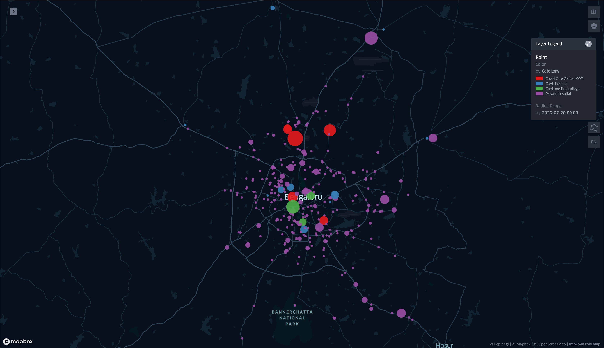

# Covid bed status

> A dedication to all the corona warriors! 🙏

_Image: Hospitals colored by category and sized by number of occupied beds._

### Workflow
There are 3 parts to this project:
1. Download and save Covid-19 hospital bed status
2. Script to extract data from the `.html` files and generate a clean `csv` file.
3. Analysis and visualization using the dataset.

### Acknowledgements
- [B.H.Anil Kumar,IAS - Commissioner, Bruhat Bengaluru Mahanagar Palike (BBMP)](https://twitter.com/BBMPCOMM/status/1282714883029491713)
- [Google Cloud - Free Tier](https://cloud.google.com/free)
